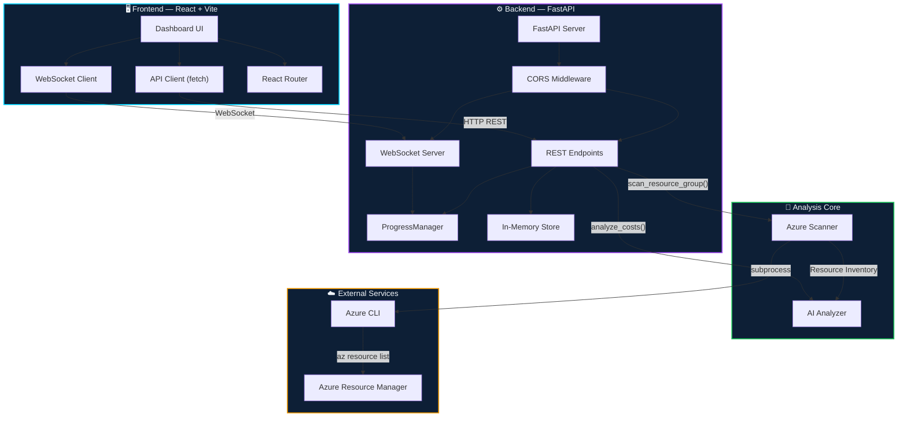
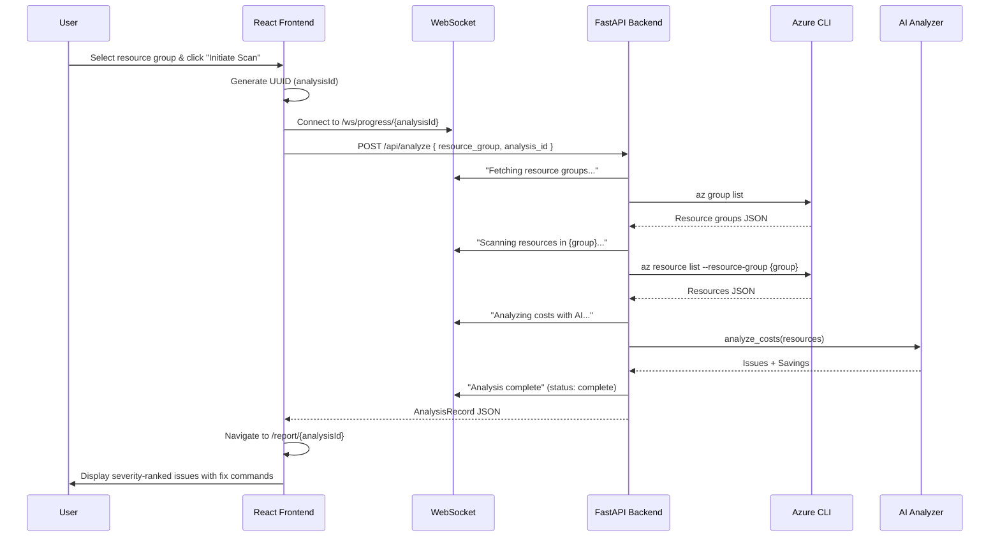

<p align="center">
  
  
  
  
  
  
  
</p>

<h1 align="center">🔍 AI Cloud Cost Detective</h1>

<p align="center">
  <strong>Intelligent FinOps assistant that scans your Azure infrastructure, detects billing waste, and delivers AI-powered cost optimization recommendations — complete with severity rankings and one-click fix commands.</strong>
</p>

<p align="center">
  <a href="#-quick-start">Quick Start</a> •
  <a href="#-features">Features</a> •
  <a href="#-architecture">Architecture</a> •
  <a href="#-tech-stack">Tech Stack</a> •
  <a href="#-api-reference">API Reference</a> •
  <a href="#-contributing">Contributing</a>
</p>

---

## 📋 Table of Contents

- [Overview](#-overview)
- [Features](#-features)
- [Architecture](#-architecture)
  - [System Architecture Diagram](#system-architecture-diagram)
  - [Data Flow](#data-flow)
  - [Directory Structure](#directory-structure)
- [Tech Stack](#-tech-stack)
- [Prerequisites](#-prerequisites)
- [Quick Start](#-quick-start)
  - [Backend Setup](#1-backend-setup)
  - [Frontend Setup](#2-frontend-setup)
- [Configuration](#-configuration)
- [API Reference](#-api-reference)
  - [REST Endpoints](#rest-endpoints)
  - [WebSocket Endpoint](#websocket-endpoint)
- [Frontend Pages](#-frontend-pages)
- [AI Analysis Engine](#-ai-analysis-engine)
- [Azure Resource Scanner](#-azure-resource-scanner)
- [Deployment](#-deployment)
- [Roadmap](#-roadmap)
- [Contributing](#-contributing)
- [License](#-license)

---

## 🌐 Overview

**AI Cloud Cost Detective** is a full-stack FinOps tool designed to help DevOps teams, cloud engineers, and engineering managers **reduce Azure cloud spending** by automatically detecting idle, orphaned, and over-provisioned resources.

The tool connects to your Azure subscription via the **Azure CLI**, scans resource groups for cost inefficiencies, and runs the inventory through an **AI-powered analysis engine** that produces severity-ranked issues with estimated savings and ready-to-run Azure CLI fix commands.

### The Problem

Cloud waste is a $100B+ problem. Organizations routinely overspend by 30–35% on cloud infrastructure due to:
- Orphaned resources (unattached disks, unused public IPs)
- Deallocated VMs with lingering storage costs
- Over-provisioned storage tiers (Premium when Standard suffices)
- Lack of visibility into resource utilization

### The Solution

AI Cloud Cost Detective automates the discovery of these cost leaks with a beautiful, real-time dashboard that gives you actionable remediation steps — not just reports.

---

## ✨ Features

| Feature | Description |
|---|---|
| 🔎 **Azure Resource Scanning** | Enumerates all resources within a selected resource group via Azure CLI |
| 🤖 **AI-Powered Analysis** | Detects cost optimization issues across compute, storage, and networking |
| 📊 **Severity Ranking** | Classifies issues as High / Medium / Low severity with color-coded badges |
| 💰 **Savings Estimation** | Calculates estimated monthly & yearly savings in USD |
| 🛠️ **Fix Commands** | Provides copy-paste Azure CLI commands to remediate each issue |
| ⚡ **Real-Time Progress** | WebSocket-powered live progress tracking during analysis |
| 🌙 **Dark Mode UI** | Premium glassmorphism design with cyan/purple accent palette |
| 🔄 **In-Memory Storage** | Fast, zero-config analysis storage (production-ready DB adapters welcome) |

### Detected Issues

| Resource Type | Issue Detected | Severity |
|---|---|---|
| `Microsoft.Compute/disks` | Unattached managed disks incurring costs | 🔴 High |
| `Microsoft.Network/publicIPAddresses` | Unassociated public IP addresses (~$3.65/mo) | 🟡 Medium |
| `Microsoft.Compute/virtualMachines` | Deallocated VMs with lingering disk charges | 🟡 Medium |
| `Microsoft.Storage/storageAccounts` | Premium storage tier potentially overprovisioned | 🟢 Low |

---

## 🏗 Architecture

### System Architecture Diagram



### Data Flow



### Directory Structure

```
AI-Cloud-Cost-Detective/
├── 📁 backend/                      # Python FastAPI server
│   ├── main.py                      # FastAPI app, endpoints, WebSocket, ProgressManager
│   ├── ai_analyzer.py               # AI-powered cost analysis engine
│   ├── azure_scanner.py             # Azure CLI wrapper & resource scanner
│   ├── requirements.txt             # Python dependencies
│   ├── .env.example                 # Environment variable template
│   └── .gitignore                   # Backend-specific ignores
│
├── 📁 frontend/                     # React + TypeScript SPA
│   ├── index.html                   # HTML entry point
│   ├── package.json                 # Node.js dependencies & scripts
│   ├── vite.config.ts               # Vite dev server + API proxy config
│   ├── tsconfig.json                # TypeScript compiler options
│   ├── tailwind.config.js           # Custom design system tokens
│   ├── postcss.config.js            # PostCSS pipeline
│   └── 📁 src/
│       ├── main.tsx                 # React entry — BrowserRouter + StrictMode
│       ├── App.tsx                  # Route definitions (/, /report/:id)
│       ├── api.ts                   # HTTP & WebSocket client functions
│       ├── types.ts                 # TypeScript interfaces & type aliases
│       ├── index.css                # Global styles, glassmorphism, animations
│       ├── 📁 components/
│       │   ├── Navbar.tsx           # Sticky top nav with gradient branding
│       │   └── ProgressTracker.tsx  # Real-time timeline with animated dots
│       └── 📁 pages/
│           ├── Dashboard.tsx        # Resource group selector + scan launcher
│           ├── Report.tsx           # Analysis results with issue cards & fix commands

│
└── README.md                        # ← You are here
```

---

## 🛠 Tech Stack

### Backend

| Technology | Purpose | Version |
|---|---|---|
| **Python** | Runtime | 3.11+ |
| **FastAPI** | Async web framework | ≥ 0.111.0 |
| **Uvicorn** | ASGI server | ≥ 0.29.0 |
| **Pydantic** | Request/response validation | v2 (bundled with FastAPI) |
| **WebSockets** | Real-time progress streaming | ≥ 12.0 |
| **python-dotenv** | Environment variable management | ≥ 1.0.0 |
| **Azure CLI** | Infrastructure scanning | Latest |

### Frontend

| Technology | Purpose | Version |
|---|---|---|
| **React** | UI framework | Latest (18+) |
| **TypeScript** | Type-safe JavaScript | Latest |
| **Vite** | Build tool & dev server | Latest |
| **React Router** | Client-side routing | Latest (v6) |
| **Tailwind CSS** | Utility-first CSS framework | ^3.4 |
| **Lucide React** | Icon library | Latest |

### Design System

| Token | Value | Usage |
|---|---|---|
| `void` | `#020b18` | Page background |
| `abyss` | `#060f1e` | Card backgrounds |
| `surface` | `#0d1f36` | Panel backgrounds |
| `frame` | `#1a3557` | Borders, dividers |
| `signal` | `#00d4ff` | Primary accent (cyan) |
| `volt` | `#a855f7` | Secondary accent (purple) |
| `good` | `#22c55e` | Success / savings |
| `warn` | `#f59e0b` | Warning / issues |
| `danger` | `#ef4444` | Error / high severity |

### Typography

| Font | Usage |
|---|---|
| **Space Grotesk** | Display headings, stat values |
| **Inter** | Body text, UI elements |
| **JetBrains Mono** | Code blocks, CLI commands |

---

## 📦 Prerequisites

Before you begin, ensure you have the following installed:

| Requirement | Minimum Version | Installation |
|---|---|---|
| **Node.js** | 18+ | [nodejs.org](https://nodejs.org/) |
| **Python** | 3.11+ | [python.org](https://www.python.org/) |
| **Azure CLI** | Latest | [Install Azure CLI](https://aka.ms/installazurecli) |
| **Git** | Latest | [git-scm.com](https://git-scm.com/) |

You must also be **authenticated** with Azure CLI:

```bash
az login
az account show  # Verify active subscription
```

---

## 🚀 Quick Start

### 1. Clone the Repository

```bash
git clone https://github.com/UjwalNagrikar/AI-Cloud-Cost-Detective-Reduces-cloud-billing-.git
cd AI-Cloud-Cost-Detective-Reduces-cloud-billing-
```

### 2. Backend Setup

```bash
# Navigate to the backend directory
cd backend

# Create and activate virtual environment
python -m venv venv

# Windows
venv\Scripts\activate

# macOS / Linux
source venv/bin/activate

# Install dependencies
pip install -r requirements.txt

# Configure environment variables
cp .env.example .env
# Edit .env and add your OpenAI API key (if using GPT-powered analysis)
```

**Start the backend server:**

```bash
uvicorn main:app --reload --host 0.0.0.0 --port 8000
```

The API will be available at `http://localhost:8000`

### 3. Frontend Setup

```bash
# Open a new terminal and navigate to frontend
cd frontend

# Install dependencies
npm install

# Start the development server
npm run dev
```

The app will be available at `http://localhost:5173`

> **Note:** The Vite dev server is pre-configured to proxy `/api` and `/ws` requests to the FastAPI backend at `localhost:8000`, so no CORS issues during development.

---

## ⚙ Configuration

### Environment Variables

Create a `.env` file in the `backend/` directory:

```env
# Required: OpenAI API key for AI-powered analysis
OPENAI_API_KEY=your_openai_api_key_here
```

### Frontend Environment Variables (Optional)

Create a `.env` file in the `frontend/` directory:

```env
# Override the default API URL (defaults to http://localhost:8000)
VITE_API_URL=http://localhost:8000
```

### Vite Proxy Configuration

The frontend dev server proxies API and WebSocket requests automatically:

```typescript
// vite.config.ts
proxy: {
  "/api": {
    target: "http://localhost:8000",
    changeOrigin: true,
  },
  "/ws": {
    target: "ws://localhost:8000",
    ws: true,
    changeOrigin: true,
  },
}
```

---

## 📡 API Reference

### REST Endpoints

#### `GET /api/resource-groups`

List all Azure resource groups in the active subscription.

**Response:**
```json
{
  "resource_groups": [
    { "name": "my-rg", "location": "eastus" },
    { "name": "prod-rg", "location": "westeurope" }
  ]
}
```

---

#### `POST /api/analyze`

Trigger a cost analysis scan on a resource group.

**Request Body:**
```json
{
  "resource_group": "my-resource-group",
  "analysis_id": "optional-uuid"    // Auto-generated if omitted
}
```

**Response:**
```json
{
  "id": "550e8400-e29b-41d4-a716-446655440000",
  "resource_group": "my-resource-group",
  "resources_scanned": 12,
  "issues_found": 3,
  "estimated_savings": {
    "monthly": 10.95,
    "yearly": 131.40,
    "currency": "USD"
  },
  "analysis_result": {
    "issues": [
      {
        "resource_name": "orphaned-disk-01",
        "resource_type": "Microsoft.Compute/disks",
        "resource_group": "my-resource-group",
        "issue": "Unattached managed disk incurring costs",
        "suggestion": "Delete this disk or attach it to a VM",
        "severity": "high",
        "estimated_monthly_savings": "Varies ($5-50/month)",
        "fix_command": "az disk delete --name orphaned-disk-01 --resource-group my-resource-group --yes"
      }
    ],
    "estimated_savings": { "monthly": 10.95, "yearly": 131.40, "currency": "USD" }
  },
  "status": "complete",
  "created_at": "2026-07-02T15:30:00Z"
}
```

---

#### `GET /api/analyses`

List all stored analyses.

**Response:**
```json
{
  "analyses": [ /* Array of AnalysisRecord objects */ ]
}
```

---

#### `GET /api/analyses/{analysis_id}`

Retrieve a specific analysis by UUID.

**Response:** Single `AnalysisRecord` object (same schema as `/api/analyze` response).

**Error Responses:**
| Status | Detail |
|---|---|
| `404` | Analysis not found |
| `422` | `analysis_id` must be a valid UUID |

---

### WebSocket Endpoint

#### `WS /ws/progress/{analysis_id}`

Connect to receive real-time progress updates during an analysis.

**Message Format:**
```json
{
  "analysis_id": "550e8400-e29b-41d4-a716-446655440000",
  "message": "Scanning resources in my-resource-group...",
  "status": "running",        // "running" | "complete" | "error"
  "timestamp": "2026-07-02T15:30:05Z"
}
```

**Connection Flow:**
1. Client connects before calling `POST /api/analyze`
2. Backend publishes progress messages as the scan progresses
3. Final message has `status: "complete"` or `status: "error"`
4. Client closes the connection after receiving the HTTP response

---

## 🖥 Frontend Pages

### Dashboard (`/`)
The main control panel where users select an Azure resource group and initiate a cost scan. Features a two-column layout with the resource group selector on the left and a real-time progress tracker on the right.

### Report (`/report/:id`)
Displays the full analysis results after a scan completes. Includes:
- **Hero banner** with total estimated savings
- **Stat cards** for resources scanned, issues found, and savings
- **Severity breakdown** with color-coded badges (High/Medium/Low)
- **Issue cards** with explanations, savings estimates, and copyable Azure CLI fix commands


---

## 🤖 AI Analysis Engine

The AI Analyzer (`backend/ai_analyzer.py`) implements a **rule-based cost optimization engine** that evaluates scanned resources against known Azure FinOps patterns:

```
┌─────────────────────────────────────────────────────┐
│                  AI Analysis Pipeline                │
├─────────────────────────────────────────────────────┤
│                                                     │
│  Resources ──▶ Rule Engine ──▶ Issues + Savings     │
│                    │                                │
│            ┌───────┼───────┐                        │
│            ▼       ▼       ▼                        │
│         Compute  Network  Storage                   │
│         Rules    Rules    Rules                     │
│                                                     │
│  • Unattached Disks      (High)                     │
│  • Orphan Public IPs     (Medium)                   │
│  • Deallocated VMs       (Medium)                   │
│  • Premium Storage Waste (Low)                      │
│                                                     │
└─────────────────────────────────────────────────────┘
```

### Analysis Rules

| Rule | Trigger | Severity | Est. Savings |
|---|---|---|---|
| Unattached Disk | `diskState != "Attached"` | 🔴 High | $5–50/mo |
| Orphan Public IP | `ipConfiguration == null` | 🟡 Medium | $3.65/mo |
| Deallocated VM | `powerState contains "deallocated"` | 🟡 Medium | Depends on disks |
| Premium Storage | `sku.name contains "Premium"` | 🟢 Low | 40–60% reduction |

---

## 🔍 Azure Resource Scanner

The Azure Scanner (`backend/azure_scanner.py`) is a robust wrapper around the Azure CLI:

### Key Features
- **Cross-platform CLI detection** — Locates `az` or `az.cmd` on Windows/Linux/macOS
- **Lazy singleton pattern** — CLI path resolved once and cached
- **120-second timeout** — Prevents hanging on slow Azure responses
- **Structured error handling** — Custom `AzureCliError` with HTTP status codes
- **Resource normalization** — Consistent output schema regardless of Azure API quirks

### Supported Azure CLI Commands

| Command | Purpose |
|---|---|
| `az group list` | List all resource groups |
| `az resource list --resource-group {name}` | List all resources in a group |

### Normalized Resource Schema

```json
{
  "name": "my-vm",
  "type": "Microsoft.Compute/virtualMachines",
  "location": "eastus",
  "resource_group": "my-rg",
  "sku": { "name": "Standard_DS2_v2" },
  "kind": null,
  "tags": { "env": "production" },
  "properties": { "powerState": "VM deallocated" }
}
```

---

## 🚢 Deployment

### Production Build (Frontend)

```bash
cd frontend
npm run build
# Output: frontend/dist/
```

### Production Server (Backend)

```bash
cd backend
uvicorn main:app --host 0.0.0.0 --port 8000 --workers 4
```

### Docker (Recommended)

> 🚧 Docker support is on the roadmap. Community contributions welcome!

---

## 🗺 Roadmap

- [ ] 🐳 **Dockerize** — Docker Compose for one-command deployment
- [ ] 🗄️ **Persistent Storage** — PostgreSQL / SQLite for analysis history
- [ ] ☁️ **Multi-Cloud Support** — AWS Cost Explorer & GCP Billing integration
- [ ] 🤖 **GPT-4o Integration** — Enhanced AI analysis with natural language recommendations
- [ ] 📊 **Cost Trends Dashboard** — Historical spending charts and trend analysis
- [ ] 🔐 **Authentication** — OAuth2 / Azure AD integration
- [ ] 📧 **Alerts & Notifications** — Slack/Email alerts for detected waste
- [ ] 🏷️ **Tag-Based Analysis** — Group costs by tags, projects, or teams
- [ ] ⏱️ **Scheduled Scans** — Cron-based automated analysis
- [ ] 📋 **Export Reports** — PDF / CSV report generation

---

## 🤝 Contributing

We love contributions! AI Cloud Cost Detective is **open source** and community-driven.

### How to Contribute

1. **Fork** the repository
2. **Create** a feature branch
   ```bash
   git checkout -b feature/amazing-feature
   ```
3. **Commit** your changes
   ```bash
   git commit -m "feat: add amazing feature"
   ```
4. **Push** to your branch
   ```bash
   git push origin feature/amazing-feature
   ```
5. **Open** a Pull Request

### Contribution Guidelines

- Follow the existing code style and conventions
- Write descriptive commit messages following [Conventional Commits](https://www.conventionalcommits.org/)
- Add TypeScript types for all new frontend code
- Add docstrings for all new Python functions
- Test your changes locally before submitting a PR
- Update this README if your changes affect the project setup or API

### Development Tips

- Backend hot-reload is enabled with `--reload` flag on Uvicorn
- Frontend hot-reload is built into Vite's dev server
- Use the Vite proxy to avoid CORS during development
- Check Azure CLI authentication with `az account show` before running scans

---

## 📄 License

This project is open source and available under the [MIT License](LICENSE).

---

<p align="center">
  <strong>Built with ❤️ for the FinOps community</strong>
  <br />
  <sub>If this tool saved you money, consider giving it a ⭐ on GitHub!</sub>
</p>
